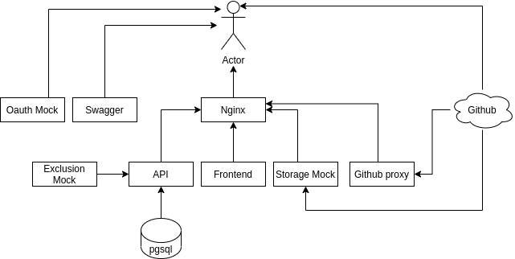

# Basic Demo Environment for AirView

## Overview
This is a docker-compose based deployment of the core AirView components. When executed, you will have a self contained stack with the following architecture:




### Components
#### Nginx
Provides reverse proxy into application. Routing within nginx is handled via location prefixes. This allows different services within the application stack to be returned on a single host/port, avoiding CORS related issues. The prefix/route mappings are:

| Prefix       | Service   |
|--------------|-----------|
|/_api/api     | AirView API
|/_api/storage | Static storage mock service
|/             | Catch all route serving AirView frontend 


### AirView Frontend
The single page application as found in this repo - https://github.com/AirWalk-Digital/airview-frontend

### AirView API
The main backend api for the application as found in this repo - https://github.com/AirWalk-Digital/airview-api

Persists data into the PGSQL database service.

### Storage Mock
Mock service to allow the application to operate without markdown content as this is not supported currently.

### Oauth Mock
Mock service to allow the frontend SPA to execute it's authentication flow against a mock oauth2 provider

### PGSQL
Postgres backend relational db

### Swagger
Swagger UI provides api documentation page based on openapi spec

## Running the stack
Provided that you have docker-compose installed locally (https://docs.docker.com/compose/install/), the stack can be started with 

```docker-compose up```

Then, you should be able to browse to http://localhost:5000 and view the frontend.

To access the API, you should be able to make calls to the api from the base url of http://localhost:5000/_api/api - e.g. to list all applications - http://localhost:5000/_api/api/applications/

Documentation based on the OpenApi specification of the api is served at http://localhost:5001

Please refer to the API & frontend repositories for more information on how to interact with the application


## Example client usage
The below script shows how to create some basic data using the client library described here - https://github.com/AirWalk-Digital/airview-api/blob/main/docs/airviewclienthowto.md


``` python

from airviewclient import client, models

base_url = "http://localhost:5000/_api/api"
system_id = 1

referencing_type = "cloud_account_id"

client_handler = client.get_handler(
    base_url=base_url,
    system_id=system_id,
    referencing_type=referencing_type,
    token=None,  # No token auth for demo environment
)

# Compliance events can be sent directly to AirView
# Define an application to associate the compliance event with
application = models.Application(
    name="My Demo Application",
    reference="unique_id_1",
    environment=models.Environment(abbreviation="DEV", name="Development"),
)
# Define a techincal control against which the event has been raised
technical_control = models.TechnicalControl(
    name="All servers should be patched", reference="demo_tc_1"
)

# Send the compliance event
compliance_event = models.ComplianceEvent(
    application=application,
    technical_control=technical_control,
    resource_reference="test_desktop_2",
    status=models.MonitoredResourceState.FIXED_AUTO,
)

client_handler.handle_compliance_event(compliance_event)


## Applications can be created individually

top_level_application = models.Application(
    name="A Parent Application",
    reference="unique_id_2",
    environment=models.Environment(abbreviation="DEV", name="Development"),
)
created_app = client_handler.handle_application(top_level_application)

## Child applictions can also be created
second_level_application = models.Application(
    name="A Child Application",
    reference="unique_id_3",
    environment=models.Environment(abbreviation="DEV", name="Development"),
    parent_id=created_app.id,
)
created_app = client_handler.handle_application(top_level_application)
```
